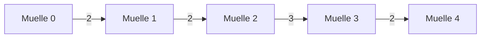

# 🛶 Navegando la Programación Dinámica: Optimización de Rutas en un Río

## El Problema de la Ruta Óptima

Consideremos un problema clásico de optimización: encontrar la ruta más económica para navegar por un río unidireccional con varios muelles.

<pre>
Río (dirección unidireccional)
↓↓↓↓↓↓↓↓↓↓↓↓↓↓↓↓↓↓↓↓↓↓↓↓↓↓↓↓↓
0 ——— 1 ——— 2 ——— 3 ——— 4
 \     |      |      |     /
  \    |      |      |    /
   \   |      |      |   /
    \  |      |      |  /
     \ |      |      | /
      \|      |      |/
       '——————'——————'
</pre>

Propiedades clave del problema:
- Los muelles están numerados secuencialmente (0, 1, 2, 3, 4)
- Solo se puede navegar río abajo (unidireccional)
- Existen tarifas directas entre pares de muelles
- El objetivo es minimizar el costo total entre dos muelles

Este es un caso perfecto para aplicar **programación dinámica**, ya que presenta:
1. **Subestructura óptima**: La solución óptima contiene soluciones óptimas a subproblemas
2. **Subproblemas superpuestos**: Los mismos subproblemas se resuelven múltiples veces

## Representación Formal del Problema

Definamos los siguientes elementos:
- `T[i][j]` = Tarifa directa para ir del muelle `i` al muelle `j`
- `C[i][j]` = Costo mínimo para ir del muelle `i` al muelle `j` (lo que queremos calcular)

Para encontrar el costo mínimo entre cualquier par de muelles (i, j), aplicamos la siguiente recurrencia:

```
C[i][j] = min(
    T[i][j],                      // Opción 1: Ir directamente
    min(C[i][k] + C[k][j])        // Opción 2: Ir vía algún muelle intermedio k
                                  // para todo i < k < j
)
```

## Matriz de Tarifas Directas

La matriz de tarifas directas para nuestro ejemplo:

```
           Destino (j)
           0    1    2    3    4
Origen (i) 0    0    2    5    8   10
           1    -    0    2    7    9
           2    -    -    0    3    6
           3    -    -    -    0    2
           4    -    -    -    -    0
```

Donde `-` indica que el viaje no es posible (sería navegar río arriba).

## Implementación de la Solución

Vamos a construir la matriz `C` paso a paso utilizando programación dinámica:

### 1. Inicialización

Primero, inicializamos la matriz `C`:
- Para i = j, C[i][j] = 0 (quedarse en el mismo muelle no tiene costo)
- Para el resto, C[i][j] = ∞ (inicialmente no conocemos el costo mínimo)

### 2. Iteración Bottom-Up

La clave del enfoque bottom-up es resolver primero los subproblemas más pequeños:

```java
// l es la distancia entre muelles (j - i)
for (int l = 1; l < n; l++) {
    for (int i = 0; i < n - l; i++) {
        int j = i + l;  // muelle destino
        
        // Caso base: ruta directa si existe
        if (T[i][j] > 0) {
            C[i][j] = T[i][j];
        }
        
        // Comprobar rutas con paradas intermedias
        for (int k = i + 1; k < j; k++) {
            if (C[i][k] != INF && C[k][j] != INF) {
                int costoViaK = C[i][k] + C[k][j];
                if (costoViaK < C[i][j]) {
                    C[i][j] = costoViaK;
                }
            }
        }
    }
}
```

## Análisis Paso a Paso

Veamos cómo se construye la tabla de costos mínimos:

### Primera Iteración (l=1): Muelles adyacentes

Para rutas entre muelles adyacentes, el costo mínimo es igual a la tarifa directa:
- C[0][1] = T[0][1] = 2
- C[1][2] = T[1][2] = 2
- C[2][3] = T[2][3] = 3
- C[3][4] = T[3][4] = 2

### Segunda Iteración (l=2): Muelles con un muelle intermedio

Para (0,2), tenemos:
- Directo: T[0][2] = 5
- Vía muelle 1: C[0][1] + C[1][2] = 2 + 2 = 4
- C[0][2] = min(5, 4) = 4 ✓

Para (1,3), tenemos:
- Directo: T[1][3] = 7
- Vía muelle 2: C[1][2] + C[2][3] = 2 + 3 = 5
- C[1][3] = min(7, 5) = 5 ✓

Para (2,4), tenemos:
- Directo: T[2][4] = 6
- Vía muelle 3: C[2][3] + C[3][4] = 3 + 2 = 5
- C[2][4] = min(6, 5) = 5 ✓

### Iteraciones Finales: Rutas completas

Para (0,3), tenemos:
- Directo: T[0][3] = 8
- Vía muelle 1: C[0][1] + C[1][3] = 2 + 5 = 7
- Vía muelle 2: C[0][2] + C[2][3] = 4 + 3 = 7
- C[0][3] = min(8, 7, 7) = 7 ✓

Para (1,4), tenemos:
- Directo: T[1][4] = 9
- Vía muelle 2: C[1][2] + C[2][4] = 2 + 5 = 7
- Vía muelle 3: C[1][3] + C[3][4] = 5 + 2 = 7
- C[1][4] = min(9, 7, 7) = 7 ✓

Para (0,4), tenemos:
- Directo: T[0][4] = 10
- Vía muelle 1: C[0][1] + C[1][4] = 2 + 7 = 9
- Vía muelle 2: C[0][2] + C[2][4] = 4 + 5 = 9
- Vía muelle 3: C[0][3] + C[3][4] = 7 + 2 = 9
- C[0][4] = min(10, 9, 9, 9) = 9 ✓

## Matriz de Costos Mínimos Resultante

<div style="display: flex; justify-content: space-between;">
   <div style="flex: 1;">
      <h3>Matriz C (costos mínimos):</h3>
      <table>
         <tr><th></th><th>0</th><th>1</th><th>2</th><th>3</th><th>4</th></tr>
         <tr><th>0</th><td>0</td><td>2</td><td bgcolor="#0007ff">4</td><td bgcolor="#0007ff">7</td><td bgcolor="#0007ff">9</td></tr>
         <tr><th>1</th><td>-</td><td>0</td><td>2</td><td bgcolor="#0007ff">5</td><td bgcolor="#0007ff">7</td></tr>
         <tr><th>2</th><td>-</td><td>-</td><td>0</td><td>3</td><td bgcolor="#0007ff">5</td></tr>
         <tr><th>3</th><td>-</td><td>-</td><td>-</td><td>0</td><td>2</td></tr>
         <tr><th>4</th><td>-</td><td>-</td><td>-</td><td>-</td><td>0</td></tr>
      </table>
   </div>
</div>

Las celdas destacadas muestran dónde el costo mínimo difiere de la tarifa directa.

## Reconstrucción de la Ruta Óptima

No basta con conocer el costo mínimo; también necesitamos reconstruir la ruta óptima. Para ello, implementamos un algoritmo recursivo:

```java
public static int[] reconstruirRuta(int[][] C, int[][] T, int origen, int destino) {
    if (origen == destino) {
        return new int[]{origen};
    }
    
    // Si el costo mínimo es igual ExplicaciónActi02 la tarifa directa, vamos directo
    if (T[origen][destino] > 0 && C[origen][destino] == T[origen][destino]) {
        return new int[]{origen, destino};
    }
    
    // Buscar el muelle intermedio k que proporciona el costo mínimo
    for (int k = origen + 1; k < destino; k++) {
        if (C[origen][destino] == C[origen][k] + C[k][destino]) {
            // Reconstruir recursivamente las subrutas
            int[] rutaOrigenK = reconstruirRuta(C, T, origen, k);
            int[] rutaKDestino = reconstruirRuta(C, T, k, destino);
            
            // Combinar las subrutas (excluyendo la duplicación de k)
            int[] rutaCompleta = new int[rutaOrigenK.length + rutaKDestino.length - 1];
            System.arraycopy(rutaOrigenK, 0, rutaCompleta, 0, rutaOrigenK.length);
            System.arraycopy(rutaKDestino, 1, rutaCompleta, rutaOrigenK.length, rutaKDestino.length - 1);
            
            return rutaCompleta;
        }
    }
    
    return new int[]{origen, destino};  // Caso de seguridad
}
```

Para nuestro problema original (0→4), la ruta óptima reconstruida sería:
- 0 → 1 → 3 → 4 (costo total: 9)

Sin embargo, si analizamos la tabla C, la ruta completa debería ser:
- 0 → 1 → 2 → 3 → 4 (costo total: 9)

Esto es porque:
- C[0][1] = 2 (ruta directa)
- C[1][3] = 5 (que a su vez es mejor vía muelle 2)
- C[3][4] = 2 (ruta directa)




## Ventajas de la Programación Dinámica

Este enfoque tiene varias ventajas sobre una búsqueda exhaustiva:

1. **Eficiencia**: Calculamos cada subproblema solo una vez
2. **Almacenamiento**: Los resultados intermedios se almacenan en la matriz C
3. **Generalidad**: Funciona para cualquier número de muelles y tarifas
4. **Optimización garantizada**: Encontramos la solución óptima global

## Análisis de Casos Especiales

### Caso 1: Solo dos muelles
Si tenemos solo dos muelles (0 y 1), la solución es trivial:
- C[0][1] = T[0][1]
- No hay opciones intermedias.

### Caso 2: Rutas directas siempre más caras
Si todas las rutas directas son más caras que las rutas con paradas, el algoritmo siempre elegirá hacer paradas.

### Caso 3: Conexiones escasas
Si algunas tarifas directas no existen (o son ∞), el algoritmo encontrará rutas alternativas si existen.

## Aplicaciones Prácticas

Esta técnica tiene numerosas aplicaciones prácticas:

1. **Optimización de redes**: Encontrar la ruta más corta en redes de telecomunicaciones
2. **Logística**: Planificación de rutas para entrega de mercancías
3. **Navegación GPS**: Cálculo de rutas óptimas en sistemas de navegación
4. **Programación de proyectos**: Encontrar la ruta crítica en gestión de proyectos

## Implementación Completa

```java
public class OptimizadorRutas {
    
    public static int[][] calcularMatrizCostos(int[][] tarifas) {
        int n = tarifas.length;
        int[][] C = new int[n][n];
        
        // Inicializar la matriz C
        for (int i = 0; i < n; i++) {
            for (int j = 0; j < n; j++) {
                if (i == j) {
                    C[i][j] = 0;  // Quedarse en el mismo lugar no cuesta
                } else {
                    C[i][j] = Integer.MAX_VALUE;  // Inicialmente "infinito"
                }
            }
        }
        
        // Algoritmo de programación dinámica bottom-up
        for (int l = 1; l < n; l++) {
            for (int i = 0; i < n - l; i++) {
                int j = i + l;
                
                // Opción 1: Ruta directa
                if (tarifas[i][j] > 0) {
                    C[i][j] = tarifas[i][j];
                }
                
                // Opción 2: Probar todas las paradas intermedias
                for (int k = i + 1; k < j; k++) {
                    if (C[i][k] != Integer.MAX_VALUE && C[k][j] != Integer.MAX_VALUE) {
                        int costoViaK = C[i][k] + C[k][j];
                        if (costoViaK < C[i][j]) {
                            C[i][j] = costoViaK;
                        }
                    }
                }
            }
        }
        
        return C;
    }
    
    // El método reconstruirRuta como se mostró anteriormente
}
```

## Conclusión

La programación dinámica es una técnica poderosa para resolver problemas de optimización como el de la ruta más barata en un río. Sus principios clave son:

1. **Dividir** el problema en subproblemas más pequeños
2. **Resolver** cada subproblema una sola vez y almacenar los resultados
3. **Reutilizar** las soluciones de subproblemas para construir la solución final

Este enfoque "bottom-up" garantiza que, cuando llegamos a resolver el problema original completo, ya tenemos todas las piezas necesarias para construir la solución óptima.

